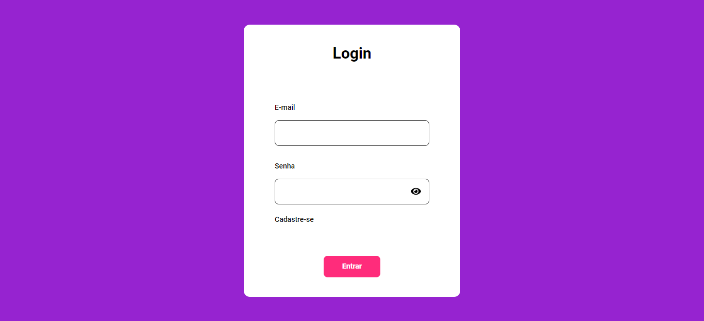
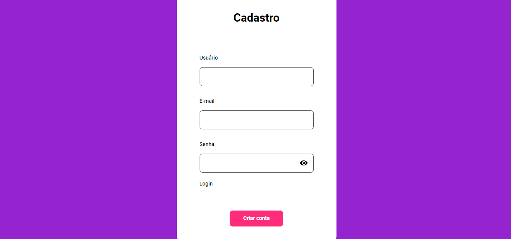
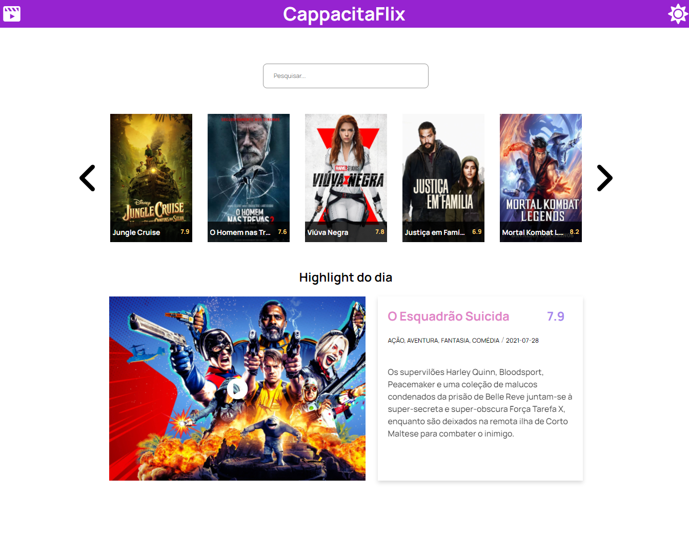

# Desafio Final - Cappacita Dev

## Seu desafio será criar um site que retorne as informações da TMDb 

The Movie Database (TMDb) é uma base de dados gratuita e de código aberto sobre filmes e séries de TV, ou seja: se você quiser contribuir com o projeto e atualizar com algum filme lado B que só você conhece, é possível atualizar para colaborar com a comunidade.

Durante o projeto, foi decidido criar um sistema de login e cadastro bem simples para acesso à página de filmes. Após o login, o usuário tem acesso a uma lista de filmes com detalhes inclusos em um modal que surge quando clicado e a um campo de busca de filmes que atualiza a lista de acordo com o filme inserido. Além disso, a página possui um tema dark. O projeto foi desenvolvido sem o uso de frameworks no front.

Foram instalados os seguintes pacotes:

npm install express

npm install express-session

npm install nodemon

npm install mysql

npm install knex

npm install body-parser

Para rodar o projeto, é só inserir "npx nodemon server.js" no terminal.
